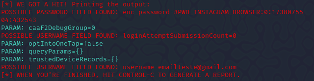

# phishing-project
O projeto de phishing foi realizado usando o SEToolkit em uma máquina virtual Linux. O objetivo foi clonar o site do Instagram para capturar nomes de usuário e senhas. Desenvolvido no Bootcamp de Cibersegurança Santander da plataforma DIO, o exercício visou treinar técnicas de ataque e defesa em segurança digital.

🔧 **Configurando Phishing no Kali Linux**  

1. **Acesso Root** 🚀  
   Abra o terminal e entre como superusuário:  
   ```bash
   sudo su
   ```  

2. **Iniciando o Setoolkit** ⚙️  
   Digite o comando para iniciar a ferramenta:  
   ```bash
   setoolkit
   ```  

3. **Escolhendo o Tipo de Ataque** 🎯  
   Selecione:  
   **1) Social-Engineering Attacks**  

4. **Definindo o Vetor de Ataque** 🌐  
   Escolha:  
   **2) Web Site Attack Vectors**  

5. **Método de Ataque** 🎣  
   Opte por:  
   **3) Credential Harvester Attack Method**  

6. **Clonando um Site** 🖼️  
   Selecione:  
   **2) Site Cloner**  
   Insira o endereço IP da sua máquina (obtido com `ifconfig` ou `ip a`).  
   Digite a URL do site que deseja clonar, como:  
   **http://www.instagram.com**  


🖥️ Resultados



